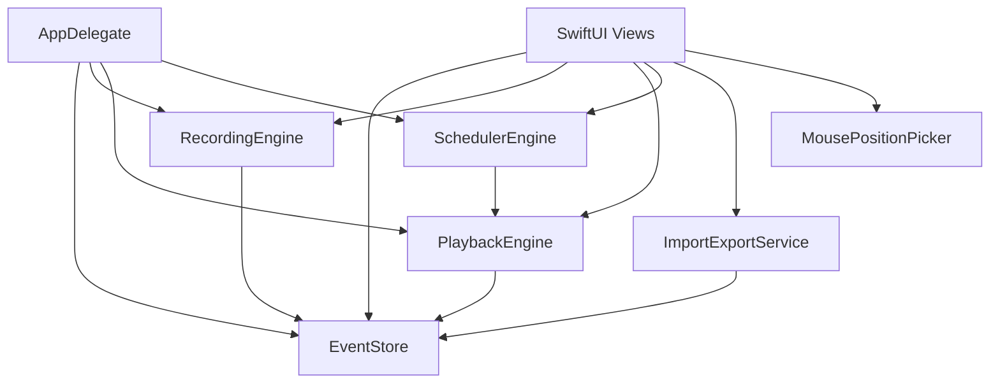

# 架构说明

MouseRecorder 是一个单 target macOS SwiftUI 应用，核心状态集中在 `EventStore`，录制、回放、定时和导入导出分别由独立 service 负责。

## 模块划分

```text
MouseRecorder/
├── App/
│   ├── MouseRecorderApp.swift        # SwiftUI app 入口、菜单命令、环境对象注入
│   └── AppDelegate.swift             # 应用生命周期、服务装配、迷你窗口模式
├── Models/
│   ├── MouseButton.swift             # 鼠标按键类型和 CGEvent 映射
│   └── MouseClickEvent.swift         # 可序列化点击事件模型
├── Services/
│   ├── EventStore.swift              # 事件列表和运行状态
│   ├── RecordingEngine.swift         # CGEvent tap 录制鼠标点击
│   ├── PlaybackEngine.swift          # 生成 CGEvent 回放点击
│   ├── SchedulerEngine.swift         # 定时触发回放
│   ├── ImportExportService.swift     # JSON 导入导出
│   ├── MousePositionPicker.swift     # 全屏坐标拾取器
│   └── AccessibilityPermissionService.swift
└── Views/
    ├── ContentView.swift             # 主导航
    ├── EventList/                    # 事件列表、行编辑、添加事件表单
    ├── Scheduler/                    # 定时运行页面
    └── Components/                   # 权限提示、状态栏等复用组件
```

## 数据流



## 关键实现

- `RecordingEngine` 使用 `CGEvent.tapCreate` 监听鼠标按下事件，并通过 `.listenOnly` 模式避免拦截用户输入。
- 录制时会过滤应用自身窗口中的点击，避免把控制按钮记录进事件列表。
- `PlaybackEngine` 使用 `Task` 串行执行事件，按 `delayBeforeFire` 等待后发布鼠标 down/up 事件。
- `SchedulerEngine` 使用 `Timer` 在主 run loop 上触发回放。
- `MousePositionPicker` 通过全屏透明 `NSPanel` 显示十字线和坐标提示。
- `ImportExportService` 使用 `Codable` JSON，并采用 ISO 8601 日期格式。

## 事件模型

```swift
struct MouseClickEvent: Identifiable, Codable, Hashable {
    var id: UUID
    var name: String
    var x: Double
    var y: Double
    var button: MouseButton
    var delayBeforeFire: TimeInterval
    var timestamp: Date
}
```

坐标使用 `CGEvent` 坐标系，以屏幕左上角为原点。多屏环境下应特别注意屏幕布局变化。

## 权限和沙盒

项目的 entitlements 中关闭了 app sandbox，并启用了 Apple Events 自动化权限。录制和回放还需要用户手动授予辅助功能权限。

## 后续扩展方向

- 将事件序列抽象为脚本或项目，支持多组保存
- 为录制和回放服务增加可测试的协议层
- 增加 Swift Testing 或 XCTest 覆盖模型、导入导出和调度逻辑
- 增加发布配置、签名说明和归档脚本
